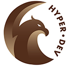
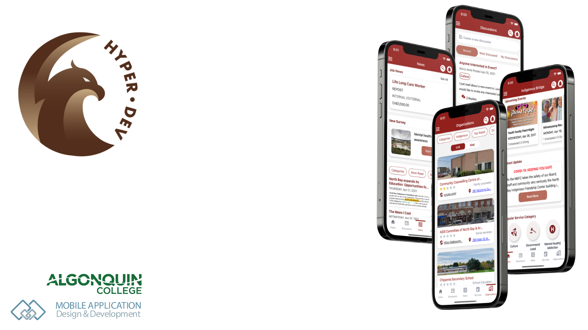
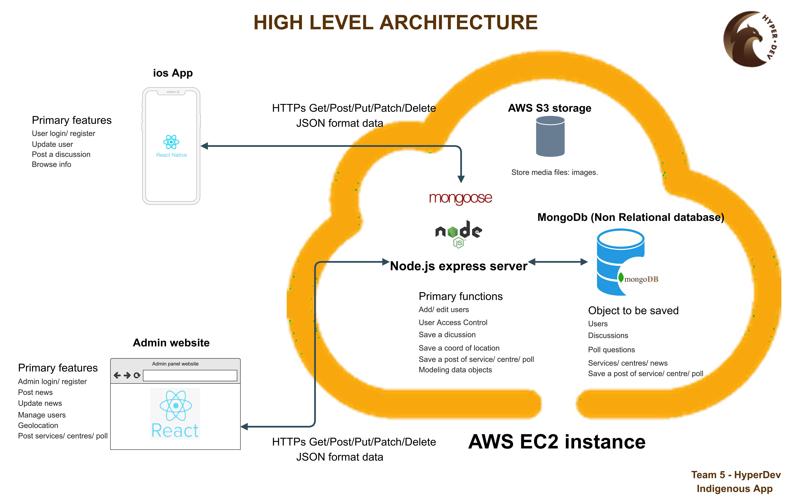
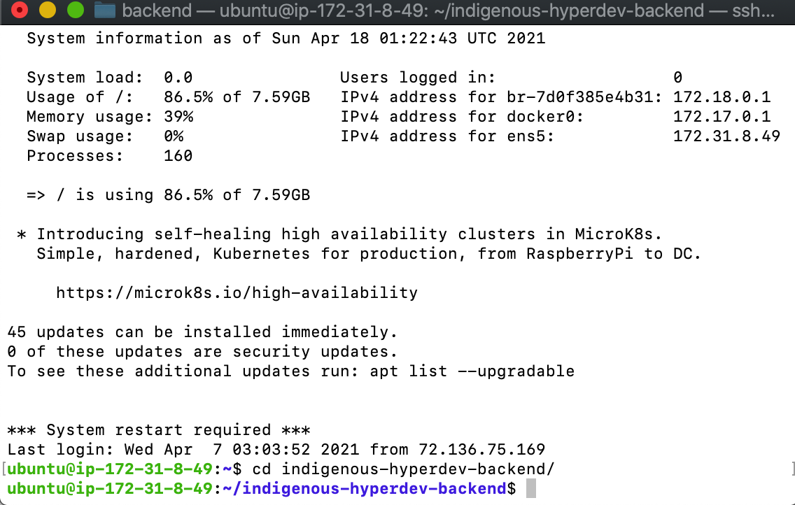
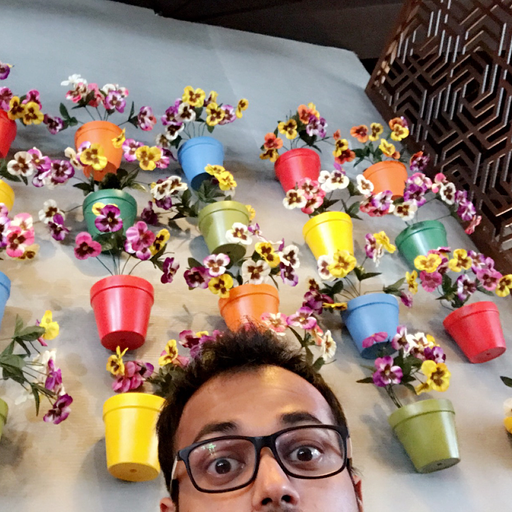

<!-- PROJECT LOGO -->
<p align="center">
  <a href="">
    
  </a>

<!-- TEAM NAME -->
  <h3 align="center">HyperDev</h3>

  <p align="center">
    A deployment document of Indigenous Bridge projects!
    <br />
    <a href=""><strong>Explore the docs »</strong></a>
    <br />
    <br />
    <a href="https://drive.google.com/drive/folders/1_aVNyS89QaNwCq4qkDKGojOqAwhEiAjL">View Demo</a>
    ·
    <a href="https://docs.google.com/spreadsheets/d/1d0rzOqYTUg8lmaQJNggO1QVCdsouy4Kd5lyFv1D2ack/edit#gid=0">Report Bug</a>
    ·
    <a href="https://docs.google.com/document/d/1MYd7TEaJzSGN-cPxNuaBuihKgYOQSZXMyqdwEfvclFE/edit">Request Feature</a>
  </p>
</p>

<!-- TABLE OF CONTENTS -->

## Table of Contents

- [About the Project](#about-the-project)
  - [Built With](#built-with)
- [Features](#features)
- [Design](#design)
  - [User Research](#userresearch)
  - [Product Research](#productresearch)
  - [Personas](#personas)
  - [User Stories & Usage Scenarios](#user-stories-usage-Scenarios)
  - [Information Architecture](#information-architecture)
  - [Paper Prototypes](#paper-prototypes)
  - [UI Wireframes](#ui-wireframes)
  - [Visual Design](#visual-design)
  - [Interactive Visual MockUp](#interactive-visual-mockup)
  - [Usability Testing Results](#usability-testing-results)
- [High-Level Architecture](#high-level-architecture)
- [Technical Research](#technical-research)
- [Getting Started](#getting-started)
  - [Prerequisites](#prerequisites)
  - [Installation](#installation)
- [Usage](#usage)
- [Roadmap](#roadmap)
- [Contact](#contact)
- [Acknowledgements](#acknowledgements)

<!-- ABOUT THE PROJECT -->

## About The Project

Indigenous-Bridge is an iOS app designed and developed for indigenous people who move or live in North Bay to seek various services and connections. The app is developed by hyperdev team at Algonquin College for NBIFC client.



### Built With

- [React JS](https://reactjs.org/)
- [React Native](https://reactnative.dev/)
- [Google Map Service](https://developers.google.com/maps/documentation)
- [MongoDb](https://www.mongodb.com/2)
- [Node Js](https://nodejs.org/en/)
- [Express Js](https://expressjs.com/)
- [AWS](https://aws.amazon.com/)

<!-- Features list -->

## Core features version 1:

- [x] User authetication: sign up, sign in, log out.
- [x] Discussion board: create, reply a discussion, sorting dicussions.
- [x] Browse information of events, news, surveys services and organizations.
- [x] Map view for organization.
- [x] Ask question: chat with admin.
- [x] App error handler.
- [x] AWS - S3 storage: upload image to S3.
- [x] Refresh screen to get new data.
- [x] Remember first login.
- [x] Web view in item detail.
- [x] Image Attachment posting discussion.

## Desirable features version 1:

- [x] Search App level: search for items of events, jobs, services, news and organizations.
- [ ] Notification: replies dicussion.
- [x] Change user avatar.
- [ ] Chip filtering
- [ ] Video Attachment.
- [ ] Change font size
- [ ] Edit user profile.
- [ ] Saved items.
- [x] Remember first login.
- [ ] Organization rating.
- [ ] Forgot password.
- [ ] Serve server thru HTTPS
- [ ] Offline mode

<!-- Design -->

## Design

Work in progress (update to follow)

### User Research

<a href="https://docs.google.com/spreadsheets/d/1QRDLhk5AxV7O4sHdwEFu3Qr7k0PTvkJDEbNzNs7dYHg/edit#gid=1136481220">User Research Document</a>

User research is the first step of the UX design process, which focuses on understanding user behaviours, needs, and motivations through observation
techniques, task analysis, and other feedback methodologies. Firstly, we created a survey with a set of questions related to our application.
As a result, we got approximately 50 responses from the people residing in North Bay and also outside of North Bay.
These results helped us to know the goals, frustrations and suggestions.

### Product Research

This research will evaluate how a product might fit into the market and learn the desired characteristics. It allows companies
to understand what the customers really want and what is likely to succeed in the market using available technology.
We researched products which are similar to our product. This research helped us to find the new features which can be
implemented in our application.

<a href="https://docs.google.com/document/d/1cyIoFJ-PAV_H0oTVj3abhuoSI_VQRAzzBIpcAF3HM8k/edit">Product Research Document</a>

### Personas

Persona represents a unique group of people who share common goals and needs. After the user research, we 
synthesize the responses considering the goals and frustrations of the people. We created three primary users 
and one secondary user. 

<a href="https://drive.google.com/drive/u/1/folders/1hFDVwcM78Yizq4ObfNcnGi0UR9Y9955E">Personas Document</a>

### User Stories & Usage Scenarios

Scenarios describe the stories and context behind why a specific user or user group uses our product. They note the goals and questions 
to be achieved and sometimes define how the user(s) can complete them with the product. We have created six scenarios for primary users 
and one for secondary users. These scenarios helped us to navigate to the next level, which is Information Architecture.

<a href="https://docs.google.com/document/d/1ZQMLUDm1wJkKaasyVJkiWBggeQF2pA7viioirBsBCT4/edit">User Stories & Usage Scenarios Document</a>

### Information Architecture

It focuses on organizing, structuring, and labelling content effectively and sustainably. The goal is to help users find 
information and complete tasks. Firstly, we created a basic layout for information architecture considering the goals of 
the users. Later, we improvised the information architecture several times to get a flawless design.

<a href="https://drive.google.com/drive/u/1/folders/18M9yS-wJo9rPX0FLQDGxTKP3opeCsn4e">Information Architecture Document</a>

### Paper Prototypes

Paper prototyping is a process where we create a paper representation of the application to realize the concepts and test designs.
We drew sketches and used them to cheaply guide the designs and study users’ reactions early in this project.

<a href="https://drive.google.com/drive/u/1/folders/1sx727_IAPQNj0NMJmTKJ-LRgrKbCASWc">Paper Prototypes Document</a>

### UI Wireframes

<a href="https://drive.google.com/drive/u/1/folders/1L93BbY0bp88kxfgi8dko2r7-Q8zmMVrG">UI Wireframes Document</a>

### Visual Design

<a href="https://drive.google.com/drive/u/1/folders/1kXj6p7TmrFLVBq_rTP_GdkPHXqL7FTkf">Visual Design Document</a>

### Interactive Visual MockUp

<a href="https://drive.google.com/drive/u/1/folders/1_8253w3diVe1B3vQV06gKMhmkgIBa0Lb">Interactive Visual MockUp Document</a>

### Usability Testing Results

<a href="https://drive.google.com/drive/u/1/folders/1xRzKI76dvbhrwCkwSynoPYCzQA8h7MBM">Usability Testing Results Document</a>

<!-- High-Level Architecture -->

## High-Level Architecture



<!-- Technical Research -->

## Technical Research

The team has researched technologies of building front-end, backend. Generally:
- We build mainly the App by React Native.
- We build the dashboard by React JS, Core UI, and React Redux.
- We build the backend by NodeJS, Express.
- We build the database by MongoDb and install in Virtual Machine EC2 of AWS.
- We deploy the backend in AWS.
- We follow the design guideline of Apple Human Guideline.
- We use AWS - S3 to store media: images/ video.

<a href="https://docs.google.com/document/d/1uoSC85jO8XEKp7pyPti2xM7suQmj_9P0R7awsHyOghk/edit">Technical Research Document</a>

<!-- Getting Started -->

## Getting Started

This is an example of how you may give instructions on setting up your project locally.
To get a local copy up and running follow these simple example steps.

### Prerequisites

This is an example of how to list things you need to use the software and how to install them.

- npm

```sh
npm install npm@latest -g
```

### Installation

1. Get a API Key at [https://example.com](https://example.com)
2. Clone the repo

```sh
git clone https://github.com/your_username_/Project-Name.git
```

3. Install NPM packages

```sh
npm install
```

4. Enter your API in `config.js`

```JS
const API_KEY = 'ENTER YOUR API';
```

<!-- USAGE EXAMPLES -->

## Usage

Use this space to show useful examples of how a project can be used. Additional screenshots, code examples and demos work well in this space. You may also link to more resources.

_For more examples, please refer to the [Documentation](https://example.com)_


<!-- Backend-->

## Backend
The backend is now running on VM EC2 in AWS. You can see the source code **ONLY in the AWS** due to the security of the backend and database.

## Access to the the backend running on Virtual Machine EC2 in AWS:
1. Open Terminal
2. Download [server_key.pem](https://drive.google.com/drive/folders/1x8_nODA5_C6YtPSmfXrJPGeOodMLCM8h) to access to the VM.
3. Navigate to the key location:
```
cd [key directory]
```
4. [Sign in](https://signin.aws.amazon.com/signin?redirect_uri=https%3A%2F%2Fconsole.aws.amazon.com%2Fconsole%2Fhome%3Fnc2%3Dh_ct%26src%3Dheader-signin%26state%3DhashArgs%2523%26isauthcode%3Dtrue&client_id=arn%3Aaws%3Aiam%3A%3A015428540659%3Auser%2Fhomepage&forceMobileApp=0&code_challenge=KEVVSl29P-PpwanhslNx0twaq92N5Y2fhSB3EuBL8NQ&code_challenge_method=SHA-256) to AWS with your credentials.

5. Navigate to EC2 -> Instances Running -> Check the box of NBIFC_server machine -> Connect -> SSH Client.
6. Run those command line in step 3 and 4. Now you are remoting the Virtual Machine EC2.
7. Go to the backend directory:
```sh
cd indigenous-hyperdev-backend/
```


This is the folder of backend source code. 

8. Re-deploy the backend by Docker after modification.
```sh
docker build --tag=indigenous:latest .

docker-compose up -d
```

9. Delete the docker images if needed.
```sh
docker images

docker image rm --force [image Id]
```
You can also see the source code, or download it to your computer in [google drive](https://drive.google.com/drive/folders/1x8_nODA5_C6YtPSmfXrJPGeOodMLCM8h)

<!-- Dashboard -->

## Admin Dashboard


<!-- ROADMAP -->

## Roadmap

In next phrase, we will implement those features:

- Serve API through HTTPS
- Forgot Password in the app.
- Chip Filtering items in the app.
- Change Fontsize in app.
- User can save items in app.
- Edit user's profile in app.
- Organizations rating.
- Offline handling.

Then we will update the design, development and run the testing.
<!-- Contact -->

## Contact

**Project Lead:** [Dana Iranpanah](mailto:iran0017@algonquinlive.com)

**Technical Lead:** [Manuel Duong](mailto:duon0060@algonquinlive.com)

**Design Lead:** [Minal Patel](mailto:pate0773@algonquinlive.com)

**UX Designer/ Developer:** [Anoj Antu](mailto:anoj0001@algonquinlive.com)

**UX Designer/ Developer:** [Sai Abhishek](mailto:baaz0002@algonquinlive.com)

<!-- Acknowledgements -->

## Acknowledgements

We express our gratitude to our instructors for their continued support and encouragement:
- Miss **Su Cheng Lee** - our professor of Mobile Application Design & Development Programat Algonquin College.
- **Adesh Shah**- Investigator at the Data Analytics Centre and Part-time Professor in the Mobile Application Design & Development Program at Algonquin College.

 


We offer our sincere appreciation for the learning opportunities provided by our instructors.

Our completion of this project could not have been accomplished without the support of our team members - **HyperDev Team**: Dana Iranpanah, Manuel Duong, Minal Patel, Anoj Antu, and Sai Abhishek.
Thank you for allowing research and develop the applied project.

Finally, to our professional client - **North Bay Indigenous Friendships Center**: our deepest gratitude. Thanks for your collaboration in the project. Your feedback helps us improve our offerings and help troubleshoot for you, so we really appreciate you taking the time.

 


